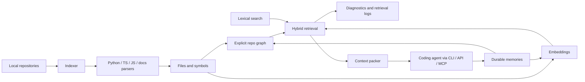

# Ariadne Evidence Report

This report summarizes the current evidence for Ariadne as of the `main` branch after the first ContextBench smoke run.

## Claim

Ariadne is a local-first repository index for AI coding workflows. It combines structural graph retrieval, lexical search, deterministic or OpenAI embeddings, durable memory, retrieval traces, and context packing so coding agents can request task-specific context instead of repeatedly reading files by trial and error.

The current evidence is mixed:

- the internal fixture benchmarks show Ariadne can retrieve useful code, test, doc, config, and memory artifacts on designed repo fixtures
- the live Postgres path is operational and dogfoodable through MCP
- the first public ContextBench row shows Ariadne can be compact but still miss the gold context completely

That means the next proof point is not another architectural primitive. It is task and retrieval evidence.

## Agent Context Failure Modes

Ariadne is aimed at recurring agent failure modes:

- agents burn tokens rediscovering the same files through repeated search and file reads
- lexical search finds obvious filenames but misses graph-neighbor evidence such as tests, docs, configs, and linked decisions
- vector search retrieves semantically adjacent files but lacks repository structure
- memory systems accumulate unscoped notes that pollute future retrieval
- compact context can look efficient while silently excluding required files

Ariadne's design tries to make these failure modes measurable:

- retrieval stages are logged
- packed context is explicit
- memories are graph nodes rather than hidden prompt text
- benchmark misses are classified as `not_generated`, `scored_too_low`, or `packed_out`

## Current Internal Benchmarks

The internal benchmarks use two local fixture repositories.

Spinner stresses coding-agent runtime, context packing, providers, and patching workflows.

Current Spinner benchmark summary:

- file hit rate: `1.0`
- symbol hit rate: `1.0`
- test hit rate: `1.0`
- doc hit rate: `0.636`
- memory hit rate: `1.0`
- average artifact recall: `0.72`

Quay stresses config-heavy service code, tenant context, webhooks, audit, billing, and runbooks.

Current Quay benchmark summary:

- file hit rate: `1.0`
- symbol hit rate: `1.0`
- test hit rate: `0.8`
- doc hit rate: `0.833`
- memory hit rate: `1.0`
- average artifact recall: `0.692`

Interpretation:

- internal fixture retrieval is functional enough to guide ranking work
- docs and support artifacts remain weaker than code and memory retrieval
- these fixture numbers are useful regression checks, not enough to claim public benchmark quality

## MCP Dogfooding

Ariadne exposes a stdio MCP server with:

- `repo_list`
- `repo_add`
- `repo_index`
- `search`
- `retrieve`
- `pack_context`
- `trace`
- `graph`
- `memory_list`
- `memory_add`
- `memory_link`
- `retrieval_logs`
- `doctor`

The Codex dogfooding guide is in `docs/codex-mcp-dogfooding.md`.

The smoke check verifies:

- MCP initialization
- expected tool availability
- database compatibility through `doctor`
- live indexing through `repo_index`
- commit metadata through `repo_list`
- retrieval through `pack_context`

## First Public Benchmark Smoke

The first public benchmark target is ContextBench because it directly evaluates coding-agent context retrieval quality and token efficiency.

Setup:

- dataset: `Contextbench/ContextBench`
- config: `contextbench_verified`
- repo: `astropy/astropy`
- instance: `SWE-Bench-Verified__python__maintenance__bugfix__deb49033`
- base commit: `6500928dc0e57be8f06d1162eacc3ba5e2eff692`
- retrieval limit: `8`
- include code snippets: `false`

First result:

- gold files: `9`
- retrieved files: `8`
- hit files: `0`
- file recall: `0.0`
- file precision: `0.0`
- packed token estimate: `922`
- gold-context token estimate: `3572`
- recall per 1k packed tokens: `0.0`

Diagnostic rerun after adding a simple baseline:

- Ariadne file recall: `0.0`
- Ariadne packed token estimate: `984`
- simple baseline file recall: `0.1111`
- simple baseline token estimate: `250`
- baseline hit: `astropy/coordinates/builtin_frames/cirs_observed_transforms.py`
- missing-file reasons: `not_generated=9`, `scored_too_low=0`, `packed_out=0`

Interpretation:

- Ariadne was compact, but compactness was not useful because it missed every gold file
- the miss was a candidate-generation/query-interpretation failure, not a context-packing limit failure
- a simple path/content overlap baseline beat Ariadne on this row
- no retrieval tuning should be done from this one row alone

The detailed smoke result is in `benchmarks/results/contextbench-smoke-2026-05-07.md`.

## Architecture

## What Would Be Convincing Next

The next evidence layer should compare baseline workflows against Ariadne-backed workflows on small but realistic tasks.

Minimum task set:

- add logging across a module
- refactor a function used in multiple files
- fix a bug from an issue description
- update config-driven behavior plus tests
- add or update docs/runbook coverage for a behavior change

Track:

- task success
- token usage
- tool calls
- time to completion
- retrieval misses
- whether Ariadne context reduced repeated file reads

The near-term goal is not to claim Ariadne is better. The goal is to produce honest traces showing where it helps, where it is neutral, and where it fails.
